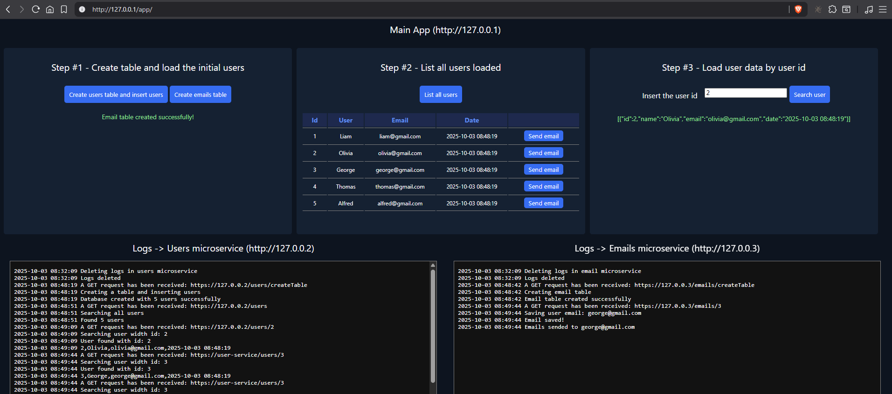

# Microservices in PHP + Docker
Example of microservices in PHP + Docker

This repository contains a small project to see how the microservices work. 

You will need to install `Docker` (Docker compose) to launch the diferents services to start and to test it.



## About the script

This script launch three services. The first one is the main app, the second one is a microservice which manage users, and the third one is a microservice to forwarding of emails.

When you start the project, you can see how the main app sends requests to the other `services`, in order to get information and also how the backend `microservices` interact within them and with diferents data bases.

This code is developed in PHP to the backend `microservices` and HTML + JS + CSS to the main app.

## Services

### Main app
- Apache (lastest)
- HTML, Javascript, CSS

### Users microservice
- Apache (lastest)
- PHP 7.4
- MySQL

### Emails microservice
- Apache (lastest)
- PHP 7.4
- MariaDB

## How start

Install `Docker` and download all files of this project in a localfolder. In linux or windows open a terminal and go to the project folder.

The next step is to execute this code to create the images and containers in Docker and launch the services:

```Dockerfile

docker-compose up -d

```

Open a browser and open the main app with this url: http://127.0.0.1/app

And that's all!

Developed by Luis L.T.
